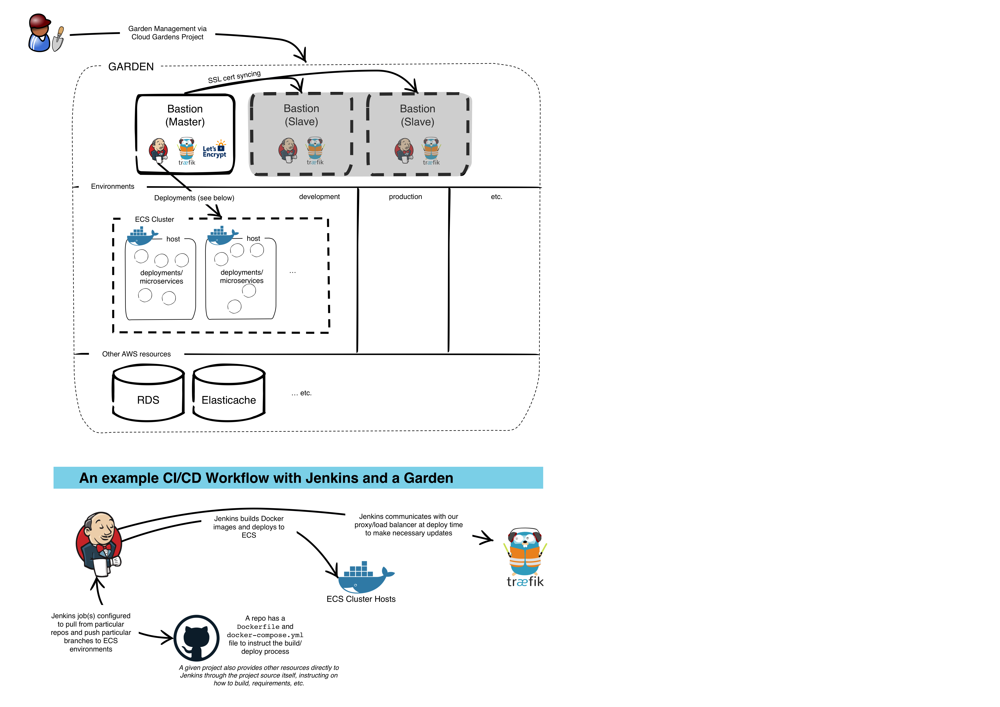

# Cloud Gardens: plant your projects, help them grow

Requirements:

There are a few key tenets for growing projects and the infrastructure to support them:

1. The infrastructure running any given project, be it your local development or production, should be identical and disposable, immutable
2. Every project and developer should be willing to adopt some practices around Continuous Integration and Deployment:
    * Some set of automated tests should be a part of every project
    * Developers should have a way to run local builds and tests prior to committing work to the common repo
    * Commits should be small and happen frequently
    * Project commits should trigger builds, testing, and other tasks relevant to the project on an integration server

# How to be a Gardener

A Gardener oversees the creation and maintenance of gardens.  It's pretty easy to do as long as you have access to an AWS (or DigitalOcean supported soon) account where you'd like the garden to live.

Some requirements:

1. [Nodejs](https://nodejs.org)
2. [Terraform](https://www.terraform.io/intro/getting-started/install.html)
3. [Create a local named AWS profile](http://docs.aws.amazon.com/cli/latest/userguide/cli-chap-getting-started.html#cli-multiple-profiles)

To install node dependencies, make sure you run `npm install` first.

Then run `node . help` to see the available commands.

You'll want to create your own configuration, and you can do so by running `node . init [name of your configuration]`.

Or you can simply make a new file named `[name of your configuration].json` in the `/config` directory based on `/config/default.json` and then run `node . use [name of your configuration]`.  Refer to the [npm config package](https://www.npmjs.com/package/config) for more info on how configuration works.

# Developing

## Testing

Testing can be divided into 3 different categories:

1. Unit testing the node scripts and libraries (underway and in a reasonable state, runnable via `npm test` and `npm run quicktest`)
2. Testing provisioning/configuration scripts in `terraform/ansible` (somewhat on its way via scripts in `terraform/ansible/tests`)
3. Behavioral, E2E testing of garden creation overall (really just hapenning manually right now and will ultimately require running on cloud accounts or some reasonable way to mock AWS/DigitalOcean, etc.)

The goal is to get all 3 working in some automated way

# Here's a diagram of what a garden actually looks like, the intended CI/CD workflow, etc

A garden is an encapsulated ecosystem containing any number of isolated environments (dev, test, production, etc.), and integration tools and services for controlling these environments.  A garden is capable of serving many environments for many projects.

